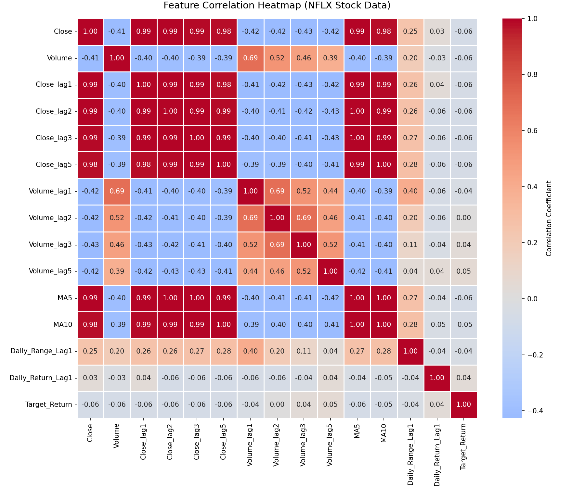
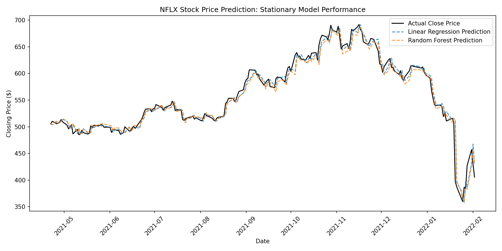
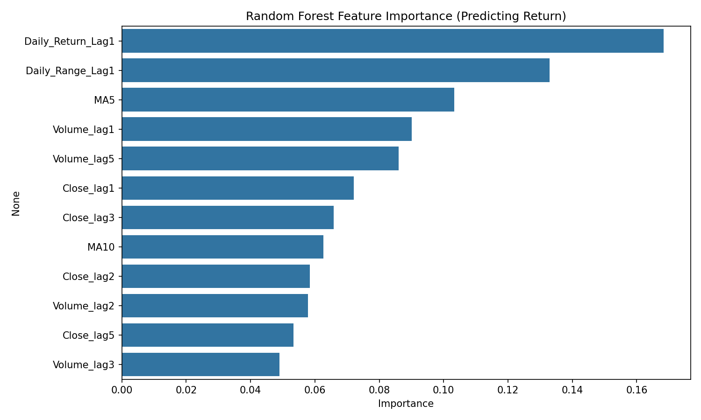

# NFLX Stock Price Prediction using Machine Learning

Predicting next-day NFLX closing price from historical OHLCV data, using a
**return-based regression** approach with Linear Regression and Random Forest,
benchmarked against a naive persistence baseline.

---

## 1. Problem Statement

This is a **regression** problem — the target is a continuous dollar price,
not a category. Classification metrics such as accuracy, precision, recall,
F1-score, and confusion matrix do not apply here; they belong to
classification tasks (e.g. Titanic survival prediction). Model quality is
instead measured with **MAE**, **RMSE**, and **R²**.

## 2. Dataset

| | |
|---|---|
| Source | NFLX historical daily OHLCV data |
| Rows | 1,009 |
| Columns | 7 (`Date`, `Open`, `High`, `Low`, `Close`, `Adj Close`, `Volume`) |
| Date range | 2018-02-05 onward |
| Missing values | None |

**Sample rows:**

| Date | Open | High | Low | Close | Adj Close | Volume |
|---|---|---|---|---|---|---|
| 2018-02-05 | 262.00 | 267.90 | 250.03 | 254.26 | 254.26 | 11,896,100 |
| 2018-02-06 | 247.70 | 266.70 | 245.00 | 265.72 | 265.72 | 12,595,800 |
| 2018-02-07 | 266.58 | 272.45 | 264.33 | 264.56 | 264.56 | 8,981,500 |
| 2018-02-08 | 267.08 | 267.62 | 250.00 | 250.10 | 250.10 | 9,306,700 |
| 2018-02-09 | 253.85 | 255.80 | 236.11 | 249.47 | 249.47 | 16,906,900 |

### Descriptive Statistics

| Column | Mean | Median | Std Dev | Variance | Min | Max | Skewness | Kurtosis |
|---|---|---|---|---|---|---|---|---|
| Open | 419.06 | 377.77 | 108.54 | 11,780.40 | 233.92 | 692.35 | 0.463 | -0.851 |
| High | 425.32 | 383.01 | 109.26 | 11,938.39 | 250.65 | 700.99 | 0.462 | -0.871 |
| Low | 412.37 | 370.88 | 107.56 | 11,568.26 | 231.23 | 686.09 | 0.459 | -0.853 |
| Close | 419.00 | 378.67 | 108.29 | 11,726.72 | 233.88 | 691.69 | 0.458 | -0.866 |
| Adj Close | 419.00 | 378.67 | 108.29 | 11,726.72 | 233.88 | 691.69 | 0.458 | -0.866 |
| Volume | 7,570,685 | 5,934,500 | 5,465,535 | 2.99e13 | 1,144,000 | 58,904,300 | 2.996 | 17.646 |

**Notes:**
- Price columns (Open/High/Low/Close) show mild positive skew and negative
  kurtosis — a fairly flat, slightly right-leaning distribution consistent
  with a multi-year uptrend punctuated by drawdowns.
- Volume is highly right-skewed (skew = 2.996) with heavy tails
  (kurtosis = 17.65), meaning a small number of days had extreme trading
  volume spikes relative to the typical day.
- `Close` and `Adj Close` are identical throughout the dataset (no dividends/
  splits affecting adjustment), so `Adj Close` was dropped as redundant.

## 3. Preprocessing

- Parsed `Date` to datetime and sorted chronologically.
- Dropped redundant `Adj Close` column (identical to `Close`).
- No missing values or duplicate rows required handling.

## 4. Feature Engineering

The target is **next-day percentage return** (`Target_Return`), not raw
price — this keeps the target stationary, which is important since raw
stock prices are non-stationary. Predictions are converted back to dollar
prices for evaluation and reporting.

| Feature | Description |
|---|---|
| `Close_lag{1,2,3,5}` | Closing price N days ago |
| `Volume_lag{1,2,3,5}` | Trading volume N days ago |
| `MA5`, `MA10` | 5-day / 10-day moving average of past closes |
| `Daily_Range_Lag1` | Previous day's High − Low |
| `Daily_Return_Lag1` | Previous day's percentage return |

All features use strictly past data (proper lagging) to avoid lookahead bias.

### Feature Correlation Heatmap



Lagged close prices and moving averages are, as expected, very highly
correlated with each other (multicollinearity typical of price-level
features). Correlations with `Target_Return` itself are weak across the
board — an early signal that next-day return is hard to predict from these
features alone.

## 5. Train/Test Split

- **Chronological 80/20 split** (no shuffling, to avoid lookahead/leakage).
- Features scaled with `StandardScaler` for Linear Regression; Random
  Forest used on unscaled features (tree-based models don't require scaling).

## 6. Models

| Model | Configuration |
|---|---|
| Naive Baseline | Persistence — predicts tomorrow's price = today's price |
| Linear Regression | Scaled features, predicts return |
| Random Forest Regressor | 200 trees, max depth 5, predicts return |

Predicted returns are converted back to dollar price levels using:
`predicted_price = today's_close × (1 + predicted_return)`

## 7. Results

*(Evaluated on dollar price levels for interpretability. Metrics are MAE,
RMSE, and R² — classification metrics do not apply to this regression task.)*

| Model | MAE ($) | RMSE ($) | R² Score |
|---|---|---|---|
| Naive Baseline (Persistence) | 7.88 | 12.83 | 0.9664 |
| Linear Regression (Return-based) | 8.17 | 13.17 | 0.9645 |
| Random Forest (Return-based) | 8.75 | 13.74 | 0.9614 |





## 8. Key Finding

The **naive persistence baseline outperforms both ML models** on every
metric. This is a meaningful, reportable result rather than a failure:

- Daily stock returns are close to a random walk — the best predictor of
  tomorrow's price is often simply today's price.
- The engineered features (lags, moving averages, volume) don't capture
  additional predictive signal beyond what persistence already implies.
- This is a well-documented phenomenon in financial time series and is
  consistent with the (semi-strong form of the) Efficient Market Hypothesis.

**Takeaway:** for short-horizon stock price prediction, always benchmark
against a naive baseline — a "good-looking" R² (0.96) can still mean the
model adds no real value once compared to persistence.

## 9. Tools & Libraries

`Python`, `pandas`, `numpy`, `scikit-learn`, `matplotlib`, `seaborn`

## 10. How to Run

```bash
pip install pandas numpy matplotlib seaborn scikit-learn
python Stock_Price_Prediction.py
```

Place `NFLX.csv` in the same directory as the script, or update the file
path in the `pd.read_csv(...)` line.

## 11. Files in This Repo

| File | Description |
|---|---|
| `Stock_Price_Prediction.py` | Full analysis script |
| `NFLX.csv` | Historical NFLX OHLCV dataset |
| `correlation_heatmap.png` | Feature correlation heatmap |
| `prediction_comparison_corrected.png` | Actual vs predicted price plot |
| `feature_importance_corrected.png` | Random Forest feature importances |
| `descriptive_statistics.csv` | Full descriptive statistics table |
| `model_comparison_results.csv` | MAE/RMSE/R² comparison table |

